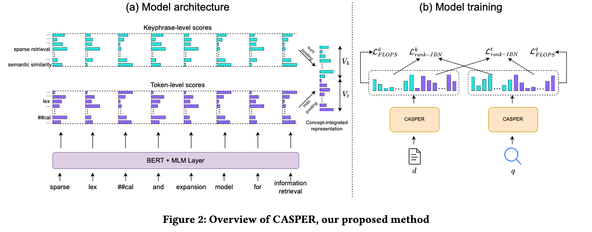
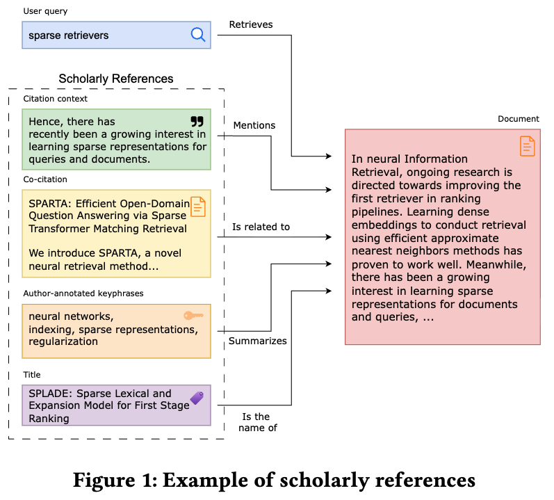

# CASPER: Concept-integrated Sparse Representation for Scientific Retrieval
**Short introduction** CASPER is a sparse model for scientific search that utilizes keyphrases, alongside tokens as representation units (i.e. a representation unit correspond to a dimension in the sparse embedding space). This enables CASPER to represent queries and texts with granular features AND research concepts, which is very important as scientific search is known to revolves around research concepts (we search for papers with specific research concepts we want to learn about). 



We also propose FRIEREN, a framework that generates training data for training scientific search models. The key idea behind FRIEREN is to leverage *scholarly references* (i.e. which we define as signals that capture how research concepts of papers are expressed in different settings). We utilize four types of scholarly references, namely *titles*, *citation contexts*, *author-assigned keyphrases*, and *co-citations*, to augment *user interaction data* (we use the [SciRepEval Search dataset](https://huggingface.co/datasets/allenai/scirepeval/viewer/search) in our work). 

<div style="text-align: center;">

</div>


We build CASPER based on [SPLADE repository](https://github.com/naver/splade). Shout out to the authors of SPLADE.


**Note**: We are still working to clean up this repository. We hope to have the clean code and all the instructions in 1 or 2 weeks (Mid September 2025).

## Installation
The project uses **Python 3.10.14**
```
cat requirements.txt | xargs -n 1 pip install
```


## CASPER


### Quick start

Please refer to [`inference_casper.ipynb`](./inference_casper.ipynb) for a quick test run


### Scientific Corpus $\mathcal{D}$
The scientific corpus $\mathcal{D}$ is used to construct the keyphrase vocabulary $V_k$ and also to perform continuous pretraining of BERT (after keyphrases from $V_k$ are added to a BERT model as new "tokens")

$\mathcal{D}$ contains concatenated titles and abstracts of scientific articles from the [S2ORC](https://github.com/allenai/s2orc) dataset. We use [the preprocessed version provided by sentence-transformer](https://huggingface.co/datasets/sentence-transformers/s2orc). This version contain titles and abstracts of over 40M articles, from which we randomly sampled 10M to form $\mathcal{D}$ with random seed = 0.


### Extracting Keyphrases

We employ ERU-KG, an unsupervised keyphrase generation/extraction model for extraction of keyphrases for all documents in $\mathcal{D}$. To do so, use the file [`create_concept_splade/s2orc/create_phrase_vocab_from_s2orc.py`](./create_concept_splade/s2orc/create_phrase_vocab_from_s2orc.py) as follows


```bash
# The scientific corpus is splitted into slices (indicated by num_slices)
# In this example, we run the script with current_slice_index = 0 to 7
# One can run the scripts in subsequence, or in parallel in different screens
CUDA_VISIBLE_DEVICES=*** python create_phrase_vocab_from_s2orc.py \
--num_slices 8 \
--current_slice_index 0 \
--output_folder /keyphrase/extraction/output/folder \
--top_k_candidates 5        # number of keyphrases extracted for each document
```

Once this is done, one can find the extracted keyphrases in `/keyphrase/extraction/output/folder`, which are the used to build the keyphrase vocabulary $V_k$

```bash
ls /keyphrase/extraction/output/folder
>>> 0.json  1.json  2.json  3.json  4.json  5.json  6.json  7.json
```
### Keyphrase Vocabulary

To build the keyphrase vocabulary $V_k$, we run the script [`create_concept_splade/vocab_create/greedy_vocab_builder.py`](./create_concept_splade/vocab_create/greedy_vocab_builder.py) as follows

```bash
python greedy_vocab_builder.py \
--input_folder /keyphrase/extraction/output/folder \
--num_phrases 30000 \
--output_file keyphrase/vocab.json
```


### Continuous Pretraining

Please refer to branch [`mlm_training`](https://github.com/louisdo/CASPER/tree/mlm_training) of this repo.

### Training CASPER

After continuous pretraining, we train CASPER as follows

```bash
SPLADE_CONFIG_NAME="config_phrase_splade" \
CUDA_VISIBLE_DEVICES=*** \
python -m splade.train
```

Please make sure to adjust hyperparameters within the configuration file [`conf/config_phrase_splade.yaml`](./conf/config_phrase_splade.yaml)

## FRIEREN
To be updated

## Evaluation
### Text Retrieval
To be updated
### Keyphrase generation
To be updated

## Reference
If you find our work useful, please consider to cite it as
```
@article{do2025casper,
  title={CASPER: Concept-integrated Sparse Representation for Scientific Retrieval},
  author={Do, Lam Thanh and Van Nguyen, Linh and Fu, David and Chang, Kevin Chen-Chuan},
  journal={arXiv preprint arXiv:2508.13394},
  year={2025}
}
```