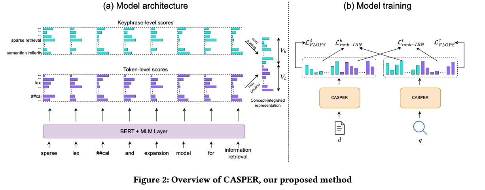
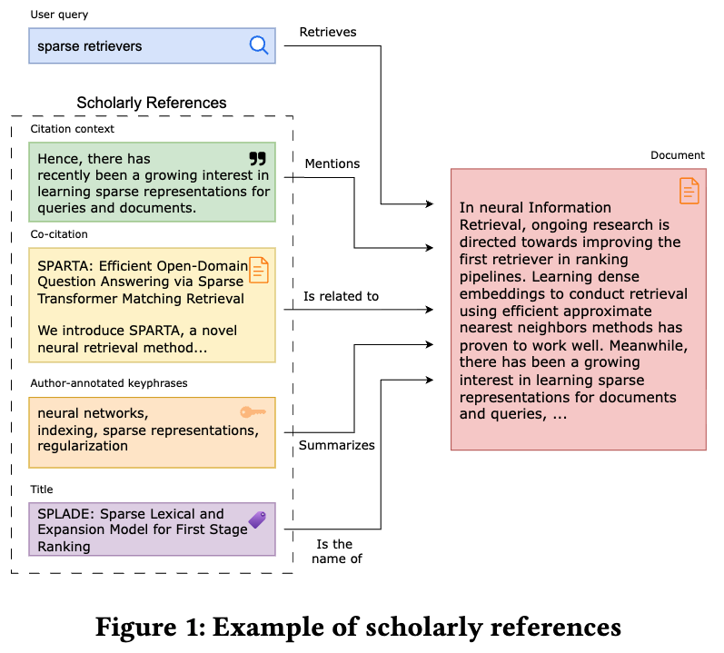

# CASPER: Concept-integrated Sparse Representation for Scientific Retrieval
**Short introduction** CASPER is a sparse model for scientific search that utilizes keyphrases, alongside tokens as representation units (i.e. a representation unit correspond to a dimension in the sparse embedding space). This enables CASPER to represent queries and texts with granular features AND research concepts, which is very important as scientific search is known to revolves around research concepts [1] (we search for papers with specific research concepts we want to learn about). 



We also propose FRIEREN, a framework that generates training data for training scientific search models. The key idea behind FRIEREN is to leverage *scholarly references* (i.e. which we define as signals that capture how research concepts of papers are expressed in different settings). We utilize four types of scholarly references, namely *titles*, *citation contexts*, *author-assigned keyphrases*, and *co-citations*, to augment *user interaction data* (we use the [SciRepEval Search dataset](https://huggingface.co/datasets/allenai/scirepeval/viewer/search) in our work). 

<div style="text-align: center;">

</div>


We build CASPER based on [SPLADE repository](https://github.com/naver/splade). Shout out to the authors of SPLADE.


**Note**: We are still working to clean up this repository. We hope to have the clean code and all the instructions in 1 or 2 weeks (Mid September 2025).

## Installation
The project uses **Python 3.10.14**
```
cat requirements.txt | xargs -n 1 pip install
```


## CASPER


### Quick start

Please refer to [`inference_casper.ipynb`](./inference_casper.ipynb) for a quick test run


### Scientific Corpus $\mathcal{D}$
The scientific corpus $\mathcal{D}$ is used to construct the keyphrase vocabulary $V_k$ and also to perform continuous pretraining of BERT (after keyphrases from $V_k$ are added to a BERT model as new "tokens")

$\mathcal{D}$ contains concatenated titles and abstracts of scientific articles from the [S2ORC](https://github.com/allenai/s2orc) dataset. We use [the preprocessed version provided by sentence-transformer](https://huggingface.co/datasets/sentence-transformers/s2orc). This version contain titles and abstracts of over 40M articles, from which we randomly sampled 10M to form $\mathcal{D}$ with random seed = 0.


### Extracting Keyphrases

We employ ERU-KG, an unsupervised keyphrase generation/extraction model for extraction of keyphrases for all documents in $\mathcal{D}$. To do so, use the file [`concept_vocab/keyphrase_extraction/create_phrase_vocab_from_s2orc.py`](./concept_vocab/keyphrase_extraction/create_phrase_vocab_from_s2orc.py) as follows


```bash
# The scientific corpus is splitted into slices (indicated by num_slices)
# In this example, we run the script with current_slice_index = 0 to 7
# One can run the scripts sequentially, or in parallel in different screens
CUDA_VISIBLE_DEVICES=*** python create_phrase_vocab_from_s2orc.py \
--num_slices 8 \
--current_slice_index 0 \
--output_folder /keyphrase/extraction/output/folder \
--top_k_candidates 5        # number of keyphrases extracted for each document
```

Once this is done, one can find the extracted keyphrases in `/keyphrase/extraction/output/folder`, which are the used to build the keyphrase vocabulary $V_k$

```bash
ls /keyphrase/extraction/output/folder
>>> 0.json  1.json  2.json  3.json  4.json  5.json  6.json  7.json
```
### Keyphrase Vocabulary

To build the keyphrase vocabulary $V_k$, we run the script [`concept_vocab/greedy_vocab_builder.py`](./concept_vocab/greedy_vocab_builder.py) as follows

```bash
python greedy_vocab_builder.py \
--input_folder /keyphrase/extraction/output/folder \
--num_phrases 30000 \
--output_file keyphrase/vocab.json
```


### Continuous Pretraining

Please refer to branch [`mlm_training`](https://github.com/louisdo/CASPER/tree/mlm_training) of this repo.

### Training CASPER

After continuous pretraining, we train CASPER as follows

```bash
SPLADE_CONFIG_NAME="config_phrase_splade" \
CUDA_VISIBLE_DEVICES=*** \
python -m splade.train
```

Please make sure to adjust hyperparameters within the configuration file [`conf/config_phrase_splade.yaml`](./conf/config_phrase_splade.yaml)

## FRIEREN
FRIEREN is a framework for generating training data for CASPER. The key idea behind FRIEREN, as mentioned above, is to leverage scholarly references as (pseudo) queries. We describe how to use it in this section.

**[Download and preprocess S2ORC corpus]**
```bash
# first go to frieren/casper/preprocessing
cd frieren/casper/preprocessing

python process_dataset.py \
--api_key YOUR_SEMANTIC_SCHOLAR_API_KEY \
--max_files 20 \
--output_folder /your/preprocessed/s2orc/folder
```
This script will download, in this example, 20 shards (out of ~350 shards in total in the S2ORC corpus). In addition, it will also extract necessary information from each of the shards
```bash
# the downloaded shards
ls /your/preprocessed/s2orc/folder/s2orc_temp
>>> 0.gz  10.gz  11.gz  12.gz  13.gz  14.gz  15.gz  16.gz  17.gz  18.gz  19.gz  1.gz  2.gz  3.gz  4.gz  5.gz  6.gz  7.gz  8.gz  9.gz

# the preprocessed data
ls /your/preprocessed/s2orc/folder/extracted_metadata
>>> 0.jsonl  10.jsonl  11.jsonl  12.jsonl  13.jsonl  14.jsonl  15.jsonl  16.jsonl  17.jsonl  18.jsonl  19.jsonl  1.jsonl  2.jsonl  3.jsonl  4.jsonl  5.jsonl  6.jsonl  7.jsonl  8.jsonl  9.jsonl
```

> TODO: Need to update instruction for getting paper metadata from Semantic Scholar API, i.e. `/your/preprocessed/s2orc/folder/metadata_from_api/metadata_from_api.jsonl`


Next, we need to obtain the metadata from Semantic Scholar paper API. More specifically, we obtain the following info for all paper ids
+ abstract
+ title
+ corpusId
+ fieldsOfStudy

```bash

python get_metadata.py --extracted_metadata_path /your/preprocessed/s2orc/folder/extracted_metadata \
--semantic_scholar_api_key YOUR_SEMANTIC_SCHOLAR_API_KEY \
--output_file /your/preprocessed/s2orc/folder/metadata_from_api/metadata_from_api.jsonl \
--s2orc_raw_folder /your/preprocessed/s2orc/folder/s2orc_temp/
```


**[Process each data type]**

+ Citation contexts
```bash
cd frieren/casper/data_types/citation_contexts/s2orc


python process_dataset.py \
--input_folder /your/preprocessed/s2orc/folder/extracted_metadata \
--output_file /your/preprocessed/s2orc/folder/citation_contexts_triplets/triplets_intermediate.tsv

python prepare_training_dataset.py \
--input_file /your/preprocessed/s2orc/folder/citation_contexts_triplets/triplets_intermediate.tsv \
--metadata_file /your/preprocessed/s2orc/folder/metadata_from_api/metadata_from_api.jsonl \
--output_file /your/preprocessed/s2orc/folder/citation_contexts_triplets/raw.tsv
```

+ Co-citations

```bash
cd frieren/casper/data_types/cocit/s2orc

python process_dataset.py \
--input_folder /your/preprocessed/s2orc/folder/extracted_metadata \
--output_file /your/preprocessed/s2orc/folder/cocit_triplets/triplets_intermediate.tsv

python prepare_training_dataset.py \
--input_file /your/preprocessed/s2orc/folder/cocit_triplets/triplets_intermediate.tsv \
--metadata_file /your/preprocessed/s2orc/folder/metadata_from_api/metadata_from_api.jsonl \
--output_file /your/preprocessed/s2orc/folder/cocit_triplets/raw.tsv
```
+ Author-assigned keyphrases
For author assigned keyphrases, we utilize two keyphrase generation dataset [KP20K](https://huggingface.co/datasets/memray/kp20k) and [KPBioMed](https://huggingface.co/datasets/taln-ls2n/kpbiomed)
```bash
cd frieren/casper/data_types/kp

mkdir /your/preprocessed/s2orc/folder/kp_triplets
python kp_datasets.py \
--output_file /your/preprocessed/s2orc/folder/kp_triplets/raw.tsv \
--max_collections 1000000
```
+ Titles
```bash
cd frieren/casper/data_types/title/s2orc

python process_dataset.py \
--input_folder /your/preprocessed/s2orc/folder/extracted_metadata \
--output_file /your/preprocessed/s2orc/folder/title_abstract_triplets/triplets_intermediate.tsv

python prepare_training_dataset.py \
--input_file /your/preprocessed/s2orc/folder/title_abstract_triplets/triplets_intermediate.tsv \
--metadata_file /your/preprocessed/s2orc/folder/metadata_from_api/metadata_from_api.jsonl \
--output_file /your/preprocessed/s2orc/folder/title_abstract_triplets/raw.tsv
```
+ User interaction data
We use [SciRepEval Search](https://huggingface.co/datasets/allenai/scirepeval/viewer/search)
```bash
cd frieren/casper/user_interaction/scirepeval_search

python prepare_training_dataset.py \
--output_file /your/preprocessed/s2orc/folder/query_triplets/raw.tsv
```


**Finally**, we combine the triplets from these sources to form the final training dataset

```bash
cd frieren/casper/combined_dataset
```
We need to first go to [`frieren/casper/combined_dataset/combine_dataset.py`](./frieren/casper/combined_dataset/combine_dataset.py), and set 
```python
...
files = {
        "kp": "/your/preprocessed/s2orc/folder/kp_triplets/raw.tsv",
        "cocit": "/your/preprocessed/s2orc/folder/cocit_triplets/raw.tsv",
        "title": "/your/preprocessed/s2orc/folder/title_abstract_triplets/raw.tsv", 
        "user_interaction": "/your/preprocessed/s2orc/folder/query_triplets/raw.tsv",
        "cc": "/your/preprocessed/s2orc/folder/citation_contexts_triplets/raw.tsv",
}

max_documents = {
  # full set
  "kp": 1500000,
  "cocit": 1500000,
  "title": 1500000,
  "user_interaction": 1500000,
  "cc": 1500000
}

...

output_folder = f"/your/preprocessed/s2orc/folder/combined_training_data/combined_{data_types_to_include_str}"
```
> TODOs: Need to adjust [`frieren/casper/combined_dataset/combine_dataset.py`](./frieren/casper/combined_dataset/combine_dataset.py) to use configuration file instead of modifying the script directly.

Run the script to combine the triplets
```bash
mkdir /your/preprocessed/s2orc/folder/combined_training_data
python combine_dataset.py
```

The path of the training data should be `/your/preprocessed/s2orc/folder/combined_training_data/combined_cc+cocit+kp+title+user_interaction/raw.tsv`

## Evaluation

### Text Retrieval
To run text retrieval evaluation:

1. Download the required data from [[DATA_URL](https://drive.google.com/file/d/1FP3dcD8Awl2A7fjxnRGBNBNnZ8jZl5WR/view?usp=sharing)] and save it in the `data/` folder.  

2. If you want to see our CASPER++ experiments, set this path accordingly [BM25_MODEL_URL](https://drive.google.com/drive/folders/1SCcrymTusrKPnWAvj9keaDIZ5oNpxbPF?usp=share_link) and update the path in `pyserini_evaluation/eval.sh`: BM25_MODELS_FOLDER=your_path

Update the absolute path of OUTPUT_FOLDER in index_and_eval.sh: export OUT_FOLDER="your_full_path"

```bash
bash index_and_eval.sh
```

### Keyphrase Generation
To run keyphrase generation:

```bash 
cd keyphrase_generation
bash infer_and_eval.sh
```


## Cite our paper
If you find our work useful, please consider to cite it as
```
@article{do2025casper,
  title={CASPER: Concept-integrated Sparse Representation for Scientific Retrieval},
  author={Do, Lam Thanh and Van Nguyen, Linh and Fu, David and Chang, Kevin Chen-Chuan},
  journal={arXiv preprint arXiv:2508.13394},
  year={2025}
}
```

## References
[1] Bramer, Wichor M., et al. "A systematic approach to searching: an efficient and complete method to develop literature searches." Journal of the Medical Library Association: JMLA 106.4 (2018): 531. 